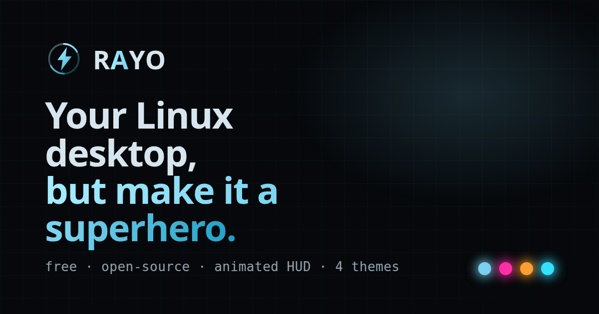

<p align="center">
  
</p>

<h1 align="center">Rayo</h1>

<p align="center"><b>Your Linux desktop, but make it a superhero.</b><br>
A free, open-source animated HUD that runs on your wallpaper.</p>

<p align="center">
  
</p>

<p align="center">
  <a href="LICENSE"></a>
  
  
  
</p>

Rayo overlays a living, breathing sci-fi interface on your desktop: a glowing
arc-reactor that pulses, glass panels showing your *real* system stats, a live
fan speedometer, and an interactive control hub. Theme it as Iron Man,
Cyberpunk, Cyborg, Tron, or build your own hero.

It is plain HTML/CSS/JS (so it can actually *animate*, unlike conky/Rainmeter)
plus one dependency-free Python file that feeds it real `/proc` data.

## Try it now, no install

Rayo is a web app at heart, so you can run the interface in your browser:

**[▶ Live demo](https://GbadeboMotunrayo.github.io/Rayo/)** *(enable GitHub Pages on this repo to serve it)*, or locally:

```bash
git clone https://github.com/GbadeboMotunrayo/Rayo.git
cd Rayo && ./run.sh          # opens the HUD at http://localhost:8099
```

## Install (on your desktop)

One line:

```bash
curl -fsSL https://raw.githubusercontent.com/GbadeboMotunrayo/Rayo/main/install.sh | bash
```

or clone and run:

```bash
git clone https://github.com/GbadeboMotunrayo/Rayo.git
cd Rayo && ./start.sh
```

`start.sh` sets a clean backdrop and mounts the transparent, click-through
overlay behind your windows. Turn it off with `./stop.sh`. The installer also
offers to start Rayo at every login.

Most GNOME/KDE systems already have what Rayo needs (`python3-gi`, `gtk-3.0`,
`webkit2gtk-4.1`). If not, on Debian/Ubuntu:

```bash
sudo apt install python3-gi gir1.2-gtk-3.0 gir1.2-webkit2-4.1
```

## The control hub

Click the reactor at the center:

- **Single click** opens a radial menu (files, terminal, web, settings, lock,
  sleep, restart, shutdown, theme, and more), each magnifying on hover.
- **Double click** opens a quick power bar (shutdown / restart / sleep / lock).
- **Triple click** shuts down, with a 4-second cancel countdown.

## Themes

A theme is a single `hud/themes/<name>/theme.json` of colour tokens. Every
colour in the HUD resolves from them, so a new theme is one JSON file.

| Theme | Vibe |
|-------|------|
| **RAYO** | Iron Man. Ice-blue and gold. |
| **Cyberpunk** | Night-city neon. Magenta and yellow. |
| **Cyborg** | Combat chassis. Molten amber. |
| **Tron** | The Grid. Electric cyan on black. |

Switch live from the hub (**THEME**), or load one with `?theme=tron`. Your
choice is remembered. Make it yours without touching themes by copying
`hud/user.example.json` to `hud/user.json` (wordmark, tagline, colours).

New hero themes are the most welcome contribution. See
[CONTRIBUTING.md](CONTRIBUTING.md).

## How it works

```
overlay/stats.py  ── writes ──▶  hud/stats.json  ── polled 1s ──▶  hud/core/*.js  ── renders ──▶  the HUD
   (/proc, /sys)
```

- `hud/index.html` plus `hud/core/` is the whole interface: a fixed 1920x1200
  design that scales to fit any screen.
- `hud/core/theme.js` applies a theme's tokens live; `control.js` drives the
  hub; `hud.js` renders the live data.
- `overlay/stats.py` is the only backend: no pip installs, standard library
  only, reads `/proc` and `/sys` once a second.
- `overlay/rayo-overlay.py` hosts the HUD as a transparent desktop window and
  pauses it when covered, so it idles near 0% CPU.

## Roadmap

- Config UI (toggle panels, pick accent, reactor position)
- More hero themes (Batman, Halo/Cortana, Samus) via community PRs
- Layer-shell backend for pixel-perfect anchoring on wlroots (Hyprland, sway)

## Support

Rayo is free and always will be. If it made your desktop cooler, a tip funds new
themes and build time:

- Ko-fi: [ko-fi.com/motunrayogbadebo](https://ko-fi.com/motunrayogbadebo)

Starring the repo, filing issues, and sending theme PRs help just as much.

## Credits

The living-orb technique and glass-panel recipe were studied from
[JashanMaan28/Zorin](https://github.com/JashanMaan28/Zorin) (MIT). Arc-reactor
composition is original. Iron Man, JARVIS, Tron and related names are
trademarks of their owners; Rayo ships no copyrighted artwork and its themes are
original interpretations.

## License

MIT. See [LICENSE](LICENSE). Use it, fork it, theme it, share it.
