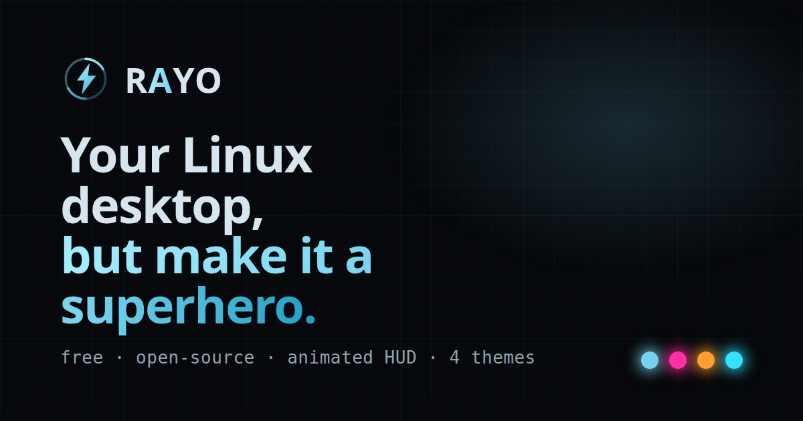

<p align="center">
  
</p>

<h1 align="center">Rayo</h1>

<p align="center"><b>Your Linux desktop, but make it a superhero.</b><br>
A free, open-source animated HUD that runs on your wallpaper.</p>

<p align="center"><em>RAYO &mdash; Radiant Assistant, Your Oracle</em><br>
<sub>(<em>rayo</em>: Spanish for &ldquo;ray of light / lightning&rdquo; &mdash; the bolt in the mark)</sub></p>

<p align="center">
  
</p>

<p align="center">
  <a href="LICENSE"></a>
  
  
  
</p>

Rayo overlays a living, breathing sci-fi interface on your desktop: a glowing
arc-reactor that pulses, glass panels showing your *real* system stats, a live
fan speedometer, and an interactive control hub. Theme it as Iron Man,
Cyberpunk, Cyborg, Tron, or build your own hero.

It is plain HTML/CSS/JS (so it can actually *animate*, unlike conky/Rainmeter)
plus one dependency-free Python file that feeds it real `/proc` data.

## Try it now, no install

Rayo is a web app at heart, so you can run the interface in your browser:

**[▶ Live demo](https://GbadeboMotunrayo.github.io/Rayo/)** *(enable GitHub Pages on this repo to serve it)*, or locally:

```bash
git clone https://github.com/GbadeboMotunrayo/Rayo.git
cd Rayo && ./run.sh          # opens the HUD at http://localhost:8099
```

## Install (on your desktop)

One line:

```bash
curl -fsSL https://raw.githubusercontent.com/GbadeboMotunrayo/Rayo/main/install.sh | bash
```

or clone and run:

```bash
git clone https://github.com/GbadeboMotunrayo/Rayo.git
cd Rayo && ./start.sh
```

`start.sh` sets a clean backdrop and mounts the transparent, click-through
overlay behind your windows. Turn it off with `./stop.sh`. The installer also
offers to start Rayo at every login.

Most GNOME/KDE systems already have what Rayo needs (`python3-gi`, `gtk-3.0`,
`webkit2gtk-4.1`). If not, on Debian/Ubuntu:

```bash
sudo apt install python3-gi gir1.2-gtk-3.0 gir1.2-webkit2-4.1
```

## The control hub

Click the reactor at the center:

- **Single click** opens a radial menu (files, terminal, web, settings, lock,
  sleep, restart, shutdown, theme, and more), each magnifying on hover.
- **Double click** opens a quick power bar (shutdown / restart / sleep / lock).
- **Triple click** shuts down, with a 4-second cancel countdown.

## Themes

A theme is a single `hud/themes/<name>/theme.json` of colour tokens. Every
colour in the HUD resolves from them, so a new theme is one JSON file.

| Theme | Vibe |
|-------|------|
| **RAYO** | Iron Man. Ice-blue and gold. |
| **Cyberpunk** | Night-city neon. Magenta and yellow. |
| **Cyborg** | Combat chassis. Molten amber. |
| **Tron** | The Grid. Electric cyan on black. |

Switch live from the hub (**THEME**), or load one with `?theme=tron`. Your
choice is remembered. Make it yours without touching themes by copying
`hud/user.example.json` to `hud/user.json` (wordmark, tagline, colours).

New hero themes are the most welcome contribution. See
[CONTRIBUTING.md](CONTRIBUTING.md).

## How it works

```
overlay/stats.py  ── writes ──▶  hud/stats.json  ── polled 1s ──▶  hud/core/*.js  ── renders ──▶  the HUD
   (/proc, /sys)
```

- `hud/index.html` plus `hud/core/` is the whole interface: a fixed 1920x1200
  design that scales to fit any screen.
- `hud/core/theme.js` applies a theme's tokens live; `control.js` drives the
  hub; `hud.js` renders the live data.
- `overlay/stats.py` is the only backend: no pip installs, standard library
  only, reads `/proc` and `/sys` once a second.
- `overlay/rayo-overlay.py` hosts the HUD as a transparent desktop window and
  pauses it when covered, so it idles near 0% CPU.

## Roadmap

- Config UI (toggle panels, pick accent, reactor position)
- More hero themes (Batman, Halo/Cortana, Samus) via community PRs
- Layer-shell backend for pixel-perfect anchoring on wlroots (Hyprland, sway)

## Voice (optional)

Talk to Rayo, offline and private. Recognition runs on-device via Vosk
(~40MB, no cloud). Two ways to use it:

- **Push-to-talk** (zero idle cost): trigger it, say one command, it runs and
  exits. Nothing runs in the background.
- **Wake word**: say **"Rayo"** (or "wake up") and it takes your next command.
  Toggle it from the hub (reactor -> **VOICE**); it's **off by default** because
  keeping an ear open uses a small continuous CPU. On = "Rayo is listening",
  off = back to zero.

```bash
./voice-setup.sh    # one-time: Vosk + Whisper (ears) + Piper (voice), under ~/.local (no sudo)
```

The wake word runs on Vosk (tiny, always listening). What you say after it
is transcribed by [Whisper](https://github.com/SYSTRAN/faster-whisper) `base.en`,
which gets names like "Paystack" right (~1.5s per command, ~200MB while voice
is on). Add your own hard words with `{"ears": {"vocab": ["Adunnwa", "CarPadi"]}}`
in `~/.config/rayo/config.json`, or go back to Vosk-only with `{"ears": {"engine": "vosk"}}`.

Rayo talks back, offline, with [Piper](https://github.com/OHF-Voice/piper1-gpl)
(default voice: British "Jenny"). It answers out loud, asks its follow-up
questions out loud, and the reactor pulses with its voice as it speaks. Say
**"stop talking"** for captions only, and **"talk to me"** to bring the voice back.
Pick another voice with `RAYO_VOICE=en_US-ryan-medium ./voice-setup.sh`.

**Turning it on and off:** tap the reactor once to open the radial menu, then
tap **VOICE**. Do the same to turn it off. The reactor shows you what's happening:

| State | What you see |
|-------|--------------|
| Armed | "VOICE ARMED" in the top strip, a faint ring around the core, VOICE glows in the menu |
| Listening | the core pulses with your voice and a spectrum ring flares around it |
| Thinking | "VOICE · THINKING" in gold while the brain works on an answer |
| Speaking | the core pulses with Rayo's own voice |
| Heard | your words as a subtitle under the reactor, with the result beneath |
| Problem | a red message under the reactor (e.g. "run ./voice-setup.sh") |

Say **"Rayo"**, wait for the chime, then:

| Say | Rayo does |
|-----|-----------|
| "open claude" · "open obs" · "launch calculator" | opens **any installed app** by name |
| "open browser" · "open files" · "open terminal" | your default browser, file manager, terminal |
| "launch browser" | asks *"which browser? brave, chromium or firefox"*, then opens the one you name ("firefox", "the second one", "default") |
| "open documents" · "open downloads" · "open desktop" | your standard folders |
| "open tech" · "open the carpadi folder" | **any folder** by name, fuzzy-matched |
| "open downloads and tech" | several folders at once |
| "open document" | asks *"which document?"*, then opens the one you name |
| "open document readme" | a document by name, straight away |
| "search for weather in lagos" | a web search |
| "open youtube" · "go to github" · "open gmail" | common sites |
| "volume up / down" · "mute" · "unmute" | sound |
| "play" · "pause" · "next song" · "previous song" | any playing media |
| "what time is it" · "what's the date" · "battery" · "temperature" | answers on the HUD |
| "next theme" · "bench mode" · "exit bench" | the HUD itself |
| "settings" · "wifi / bluetooth / sound / display settings" | system settings |
| "lock" · "sleep" · "focus" · "help" | system |

When Rayo needs a detail it asks, and the question shows under the reactor.
Just answer; no wake word is needed. It asks at most twice, and "cancel" or
"never mind" backs out. The same goes for "open folder", "launch app" and
"search".

Apps and folders are discovered from your machine, so new ones work without
changes. The full grammar lives in [`overlay/commands.py`](overlay/commands.py).

**Power by voice always asks first.** Say "shut down", "restart", "go to sleep"
or "log out" and Rayo asks *"Are you sure you want to shut down? Say yes or no."*
Only a clear yes goes ahead. "No", "maybe", silence, or anything muffled cancels.
Only a whole-sentence command counts, so "how do I restart my router" is just a
question. The brain's tools can never trigger power: only this confirmed path can.

**Personality.** Rayo is dry and sarcastic by default, in the JARVIS / TARS mould.
The real answer always comes first and is never changed; the wit is added around
it, never aimed at you personally, and dropped for critical alerts. Say
**"be nice"** (off), **"less sarcastic"** (mild) or **"be sarcastic"** (full), or set
`{"persona": {"sarcasm": "mild"}}` in `~/.config/rayo/config.json`.

### The brain (optional)

Anything that isn't a command goes to a small local LLM through
[Ollama](https://ollama.com): "why is the sky blue", "tell me a joke", "who
wrote Things Fall Apart". The answer types itself out under the reactor. It
remembers the last few exchanges, so "and how old is he?" works.

```bash
curl -fsSL https://ollama.com/install.sh | sh
ollama pull gemma3:1b        # ~800MB; any chat model works
```

- **Private:** it runs on your machine and talks only to `127.0.0.1`.
- **Light:** the model loads when you say "Rayo" and unloads 3 minutes after
  your last question. A 1-2B model uses about 1.3GB of memory while it's loaded.
- **Talk, never act:** the brain can't run commands. Opening apps and folders
  still goes through the fixed command list, so a model mistake can't touch
  your machine.
- **Pick a model:** Rayo uses `gemma3:1b` if you have it, otherwise the first
  model Ollama has. To choose one, set `RAYO_BRAIN_MODEL`, or put
  `{"brain": {"model": "qwen3:1.7b"}}` in `~/.config/rayo/config.json`.

### Hands: the brain can act (safely)

Multi-step requests ("pull up my downloads and tell me if it'll rain tonight") are
split and each piece runs through the normal commands, with no LLM needed. An
action Rayo has no command for gets an honest "I don't know how to do that yet".

The brain can also pick from a short tool list (`overlay/tools.py`: `open`,
`search_web`, `weather`, `remember`, `recall`, `battery`, `volume`, `media`,
`status`), but this is **off by default**: the 1.7B model chose the right tool for
only 12 of 20 test phrases and sometimes claimed actions it never took. Turn it
on with `{"brain": {"tools": true}}` if you run a stronger model.

There is deliberately **no tool for power, deleting, sending, shell or settings**,
and `open` refuses those words outright, so a confused small model cannot do harm.
At most three actions run per sentence. Unknown or malformed tool calls are refused.

### Awareness: Rayo speaks up first

While VOICE is on, Rayo checks every 30 seconds and speaks only when something
needs you (each alert has its own cooldown, so she doesn't nag):

| Alert | When |
|-------|------|
| Battery | 20%, 10%, 5% while unplugged; "fully charged" at 100% |
| Heat | CPU at 88°C+ for two checks, naming the app using it |
| Memory | under ~450MB free or swap almost full, naming the biggest app |
| Rain | 70%+ chance in the next three hours |

Alerts show in gold on the HUD. Quiet hours (23:00 to 07:00) show but don't speak.
Say **"status report"** any time for battery, temperature, memory, the biggest app
and the weather in one breath. **"stop alerts"** / **"alerts on"** switch them.
Settings: `{"awareness": {"on": true, "quiet": ["23:00", "07:00"]}}`.

### The cloud brain (optional): Groq every day, Claude on request

The small local model is private but not very smart. For harder questions Rayo
can ask a cloud model, using **your own API key**. Two providers:

| Provider | Role | Cost |
|----------|------|------|
| **Groq** (`openai/gpt-oss-20b`) | everyday brain: very fast, free plan, no card | free (about 1,000 requests and 200K tokens a day); paid is $0.075 / $0.30 per million tokens |
| **Claude Haiku 4.5** | "ask Claude ...": the strongest, on request | about $1 / $5 per million tokens |

```bash
./set-key.sh groq        # free key at https://console.groq.com/keys (hidden prompt, saved chmod 600)
./set-key.sh claude      # optional, https://console.anthropic.com (set a spend limit there)
```

**How a question is answered:** learned answers first (instant, free, offline),
then the cloud for substantial questions, then the small local model if you're
offline, rate-limited or over budget. The HUD says **ASKING GROQ** or **ASKING
CLAUDE** whenever a question leaves the laptop.

**Privacy:** only your question and the last couple of exchanges are sent. Never
your vault, memories, files or battery. A question that needs something you told
her ("what's my sister's name?") stays local, unless you set
`{"cloud": {"share_memory": true}}`. Groq's docs say it does not retain requests by
default (troubleshooting logs for up to 30 days, which you can switch off in its
Console), with no difference between free and paid plans. Read the provider's terms
yourself before sending anything sensitive.

**Budget:** Rayo has her own monthly cap (3 dollars, counted across providers) and
a daily limit (150 questions) on top of anything you set at the provider.

**The small model learns.** Every cloud answer is saved to `Learned.md` in your
vault. Ask again (or reword it) and she answers from there, offline. When she falls
back to the local model, the closest saved answers go into its prompt as examples.
Time-sensitive questions (news, weather, prices) and "and how old is he?" style
follow-ups are never saved. Edit or delete any entry in Obsidian.

| Say | Rayo does |
|-----|-----------|
| "ask Claude why the sky is blue" / "claude, explain tides" | forces a Claude answer |
| "ask Groq ..." / "ask the cloud ..." | forces your everyday cloud brain |
| "how much has Groq cost me" / "cloud usage" | this month's questions and cost |
| "use Groq" / "use Claude" | choose the everyday brain |
| "use the cloud" / "always use the cloud" | auto (default) / ask whenever possible |
| "stay offline" | local brain only |

Settings: `{"cloud": {"mode": "auto", "provider": "groq", "models": {"groq": "openai/gpt-oss-20b"}, "groq_paid": false, "monthly_cap_usd": 3, "daily_limit": 150}}`.

### Soul: she has a character, a mood and a history with you

Rayo's character is a short first-person Markdown note in your vault,
`Soul.md`, and what she knows about you is `Owner.md`. Edit either and she
changes (a trimmed `Soul.md` is part of the brain's prompt).

- **Small talk as data** (`overlay/soul_lines.json`, ~35 topics): who she is, what
  RAYO means, who built her, whether she's alive, Siri vs Alexa vs JARVIS, jokes,
  thanks, compliments, insults, goodnight, and more. Add your own in
  `~/.config/rayo/lines.json` (same format; yours win). Triggers use a compact
  template syntax: `(who|what) are you [really]`.
- **Real moods.** Ask "how are you?" and the answer comes from the laptop: cramped
  when memory is low, feverish when hot, running on fumes at low battery, sharp in
  the morning, mellow at night.
- **A relationship.** She counts your conversations and days together ("how long
  have we known each other?"), marks milestones, and greets you differently the
  first time, after a long absence, and at 3 a.m.
- **Follow-ups.** "And tomorrow?" after a forecast. "Say that again" repeats her
  last answer. "Not now" snoozes alerts for an hour (only a nearly dead battery
  gets through).
- **She knows when not to joke.** "I'm sad" or "I had a rough day" gets kindness,
  not sarcasm, and anything about self-harm gets a caring reply that points you to
  a real person.

### Memory (an Obsidian vault)

Rayo's memory is plain Markdown in `~/Documents/Rayo`, a folder that opens as
an [Obsidian](https://obsidian.md) vault. Nothing is hidden in a database: what
you see in the vault is what Rayo knows.

| Say | Rayo does |
|-----|-----------|
| "remember that my sister's name is Tolu" | adds a bullet to `Memory/Facts.md` |
| "what's my sister's name?" | the brain reads relevant facts before answering |
| "what do you remember" | reads back your latest facts |
| "forget that" | removes the last fact |
| "open memory" | opens the vault in Obsidian (or the folder) |

Every exchange is also logged to `Daily/YYYY-MM-DD.md`. To change the vault
location, or turn the log off, edit `~/.config/rayo/config.json`:
`{"memory": {"vault": "~/Notes/Rayo", "log": false}}`.

Small models get facts wrong sometimes, especially dates, ages and recent
events. Treat answers as a quick guess, not a source.

## Support

Rayo is free and always will be. If it made your desktop cooler, a tip funds new
themes and build time:

- Ko-fi: [ko-fi.com/motunrayogbadebo](https://ko-fi.com/motunrayogbadebo)

Starring the repo, filing issues, and sending theme PRs help just as much.

## Security

Rayo's server only listens on this PC, runs a strict content-security policy, asks before power actions, and keeps your API keys private. Run `./security/security-check.sh` to audit your machine, and see [SECURITY.md](SECURITY.md) for the details and what Rayo can't protect.

## Credits

Rayo's soul was designed after studying open-source assistants (ideas only, no code
copied): [Leon](https://github.com/leon-ai/leon) (MIT) for identity as a Markdown
file, living moods, layered memory and proactive alerts that back off;
[Mycroft personality skill](https://github.com/tiradoe/mycroft-personality-skill) (MIT)
for personality as trigger-and-reply data;
[HassIL](https://github.com/home-assistant/hassil) (Apache-2) for compact phrase
templates; and [OpenVoiceOS](https://github.com/OpenVoiceOS/ovos-core) (Apache-2) for
the order of context, then rules, then the LLM last.

The living-orb technique and glass-panel recipe were studied from
[JashanMaan28/Zorin](https://github.com/JashanMaan28/Zorin) (MIT). Arc-reactor
composition is original. Iron Man, JARVIS, Tron and related names are
trademarks of their owners; Rayo ships no copyrighted artwork and its themes are
original interpretations.

## License

MIT. See [LICENSE](LICENSE). Use it, fork it, theme it, share it.
